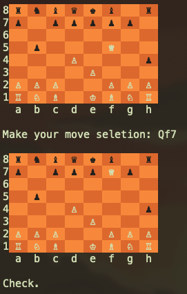

# Ruby Chess

Completed as part of The Odin Project: Ruby.

## Description

Command-line chess written in Ruby with tests using RSpec. Games can be saved and loaded in the FEN format.

## Learning Objectives

- Complete a large, complicated project with minimal guidance
- Practice implementing OOP principals
- Practice using RSpec

## Preview

